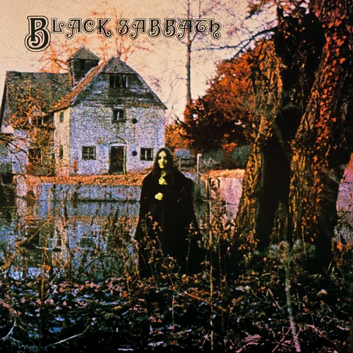
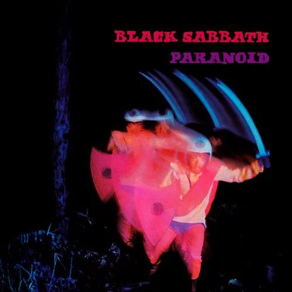
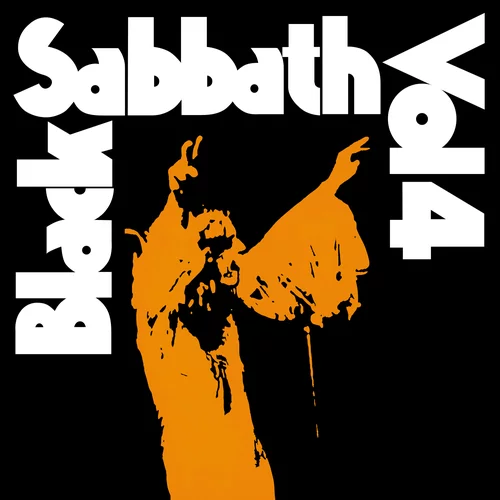
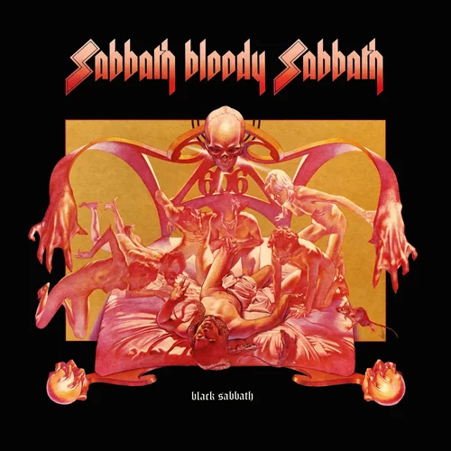
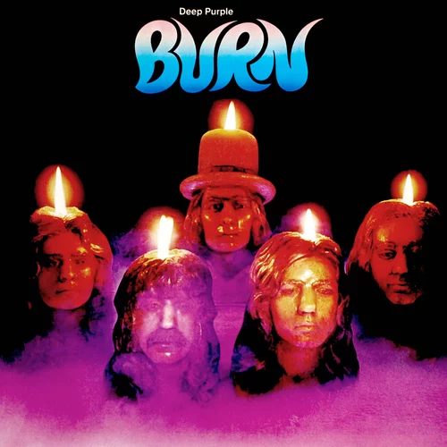
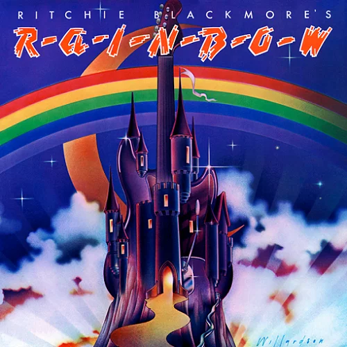
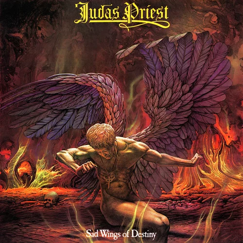
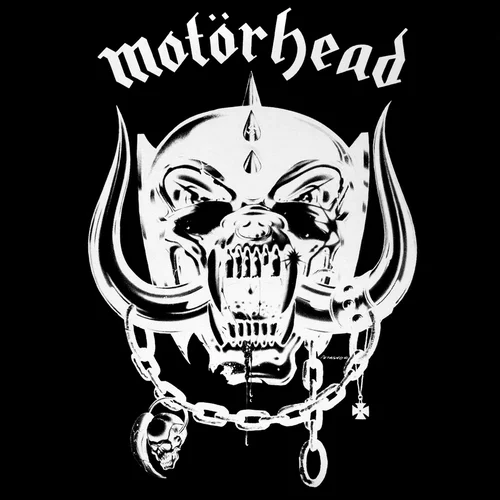
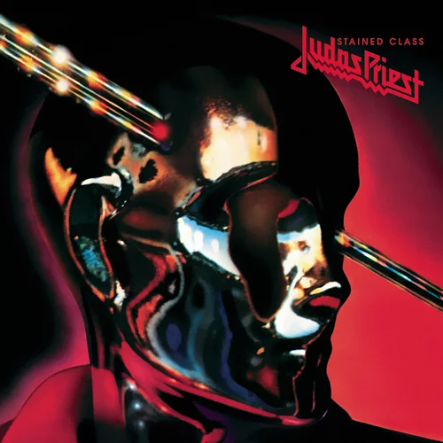

# Best Metal Album Every Year From The 70s

## 1970 - Black Sabbath - Black Sabbath

## 1971 - Paranoid - Black Sabbath

## 1972 - Vol. 4 - Black Sabbath

## 1973 - Sabbath Bloody Sabbath - Black Sabbath

## 1974 - Burn - Deep Purple

## 1975 - Ritchie Blackmoore's Rainbow - Rainbow

## 1976 - Sad Wings of Destiny - Judas Priest

## 1977 - Motörhead - Motörhead

## 1978 - Stained Class - Judas Priest

## 1979 - Overkill - Motörhead

