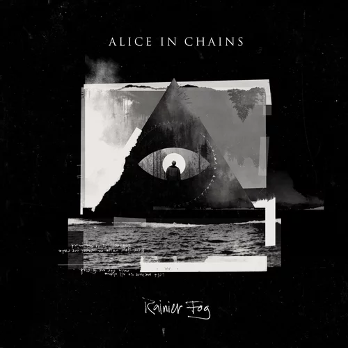
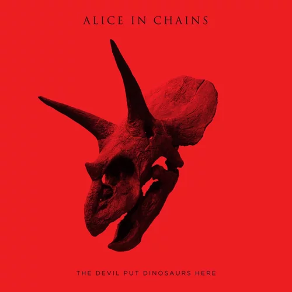
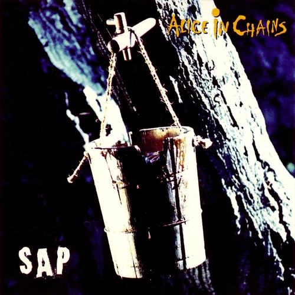
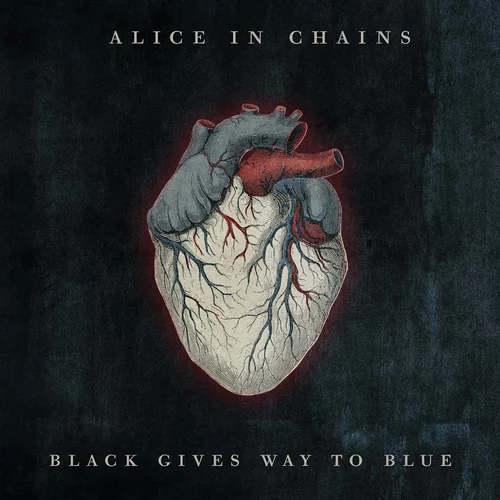
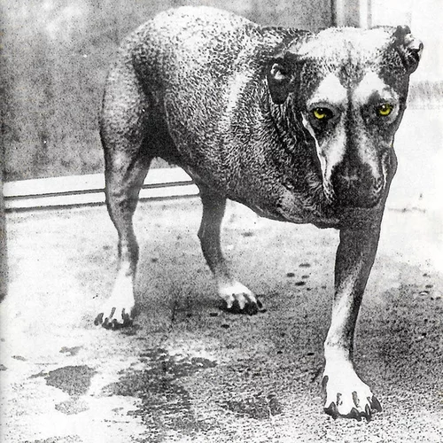
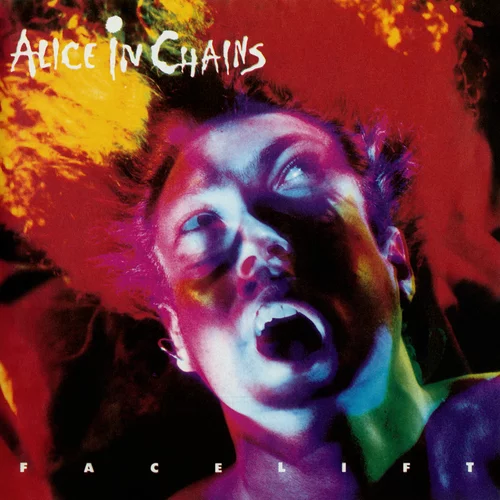
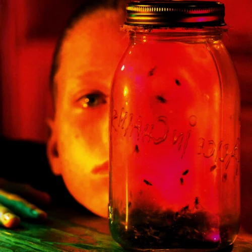
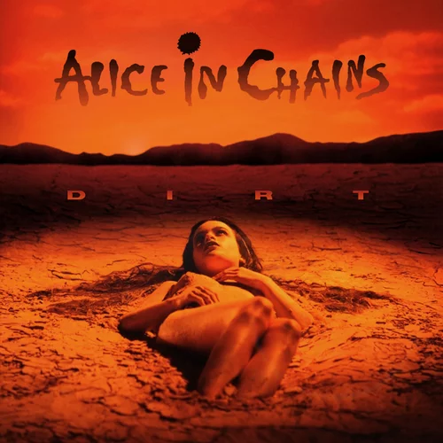

# Alice In Chains Discography Ranked

## 8. Ranier Fog (2018)

While this is last place in my rankings, this is certainly not a bad album. There is no such thing as a bad Alice In Chains album. That being said, I do feel like this is their worst album. I do like 'The One You Know' and 'Never Fade', but the rest is kind of forgetable. Still, it is not a bad album.

## 7. The Devil Put Dinosaurs here (2013)

Most fans would agree this is not the band's bset work. However, I do feel it is sort of underrated. 'Hollow', 'Stone', and 'Voices' are great songs. I do agree this is not as good as some of their other releases, but it definately deserves more love.

## 6. Sap (1992)

Probably their least release album. 'Got Me Wrong' is a banger. The other songs are not quite as good, but this is still a great EP. They certainly made up for it with their next release, 'Dirt'. Overall, pretty good EP.

## 5. Black Gives Way to Blue (2009)

Their first album without Layne. I feel this album is solid. I don't feel like this album is very consistent. 'Check My Brain' is a banger, but the rest of the songs sort of blend in. Other than that, this is a great album worth giving a listen.

## 4. Alice In Chains (1995)

A great album which I'm shocked does not have more commercial success. This album is beloved by fans and for good reason. 'Sludge Factory', 'Heaven Beside You', 'Again', and 'God Am' are all bangers. This album is very consistent.

## 3. Facelift (1990)

What a debut! This album is filled with great songs. Obviously, 'Man in the Box' is a classic and probably my favorite Alice In Chains song. However, 'We Die Young', 'Sea of Sorrow', and 'Bleed the Freak' are also bangers. My only issue with this album is that after the first 4 songs, it all sort of blends in. Overall a great record.

## 2. Jar of Flies (1993)

This EP is very saddening, no doubt about it. The songs are very depressing but at the same time, they are somehow calming. From 'Rotten Apple', to 'Nutshell', to 'I Stay Away', to 'No Excuses', this whole EP is amazing.

## 1. Dirt (1992)

Without a doubt one of the best grunge albums ever. The whole 58 minutes is killer. This album truely has no filler. 'Them Bones', 'Dam That River', 'Angry Chair', 'Rooster', 'Down in a Hole', and 'Would?' are all some of my favorite grunge songs ever. This album is truely a masterpiece.
