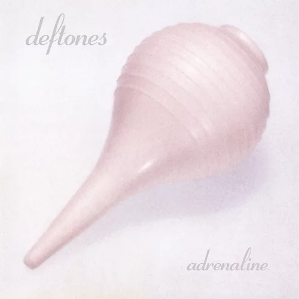
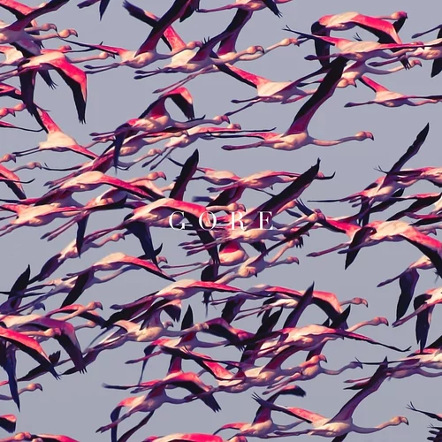
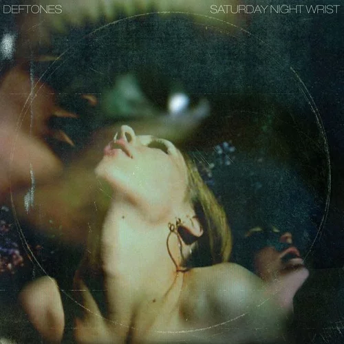
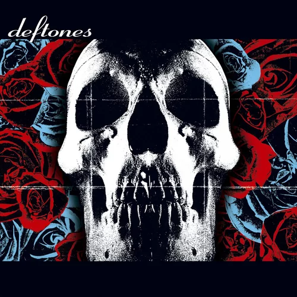
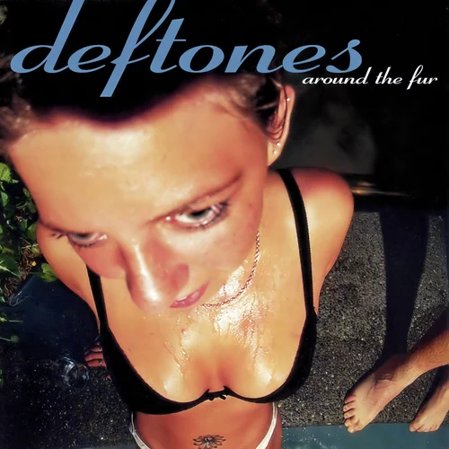
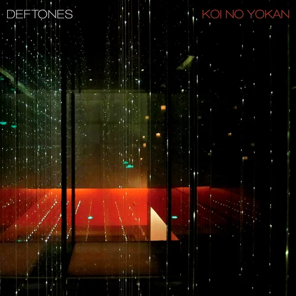
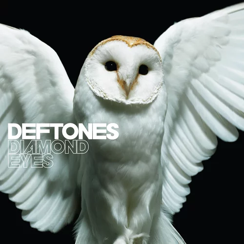

# Deftones Discography Ranked

## 9. Adrenaline (1995)

Their most dated album, 'Adrenaline'. To be fair to the band, this is their debut. They haven't really found their sound yet and this is just another nu metal album. I do think 'Bored' and '7 Words' are pretty good songs. However, the rest is just basic nu metal. Although, let's be real, this was better than like 90% of nu metal at the time.

## 8. Gore (2016)

After 'Koi No Yokan' was released, they released 'Gore'. Not really much to say about this album as it doesn't really have standout songs, which is my main issue with it. It is a solid album, but nothing really stands out. Definately a step down from Koi No Yokan.

## 7. Saturday Night Wrist (2006)

This is a very hit or miss album. On one hand, it has great songs like 'Hole in the Earth', and 'Cherry Waves'. And on the other hand, it has 'Pink Cellphone'. Pink Cellphone is a trash song, no other way around it. Regardless, the other songs on this album are pretty good.

## 6. Deftones (2003)

How could they possibly follow up White Pony? Experimenting. This is without a doubt their most experimental release. The obvious top song is 'Minerva' which is without a doubt one of their best songs. However, songs like 'Battle Axe', and 'Bloody Cape' are also very good. And let's not forget about the insanely chaotic 'Hexagram'. Overall, this is a very solid album.

## 5. Ohms (2020)

After the slightly disapointing release of 'Gore', they made up for it with this amazing album. Not really much to say about this album. Top tracks would probably be 'Ceremony', 'Genesis', and 'Ohms'.

## 4. Around the Fur (1997)

Their sophomore release. They still have not found their sound in this album, but that does not stop it from being one of their best. This album has melodic songs like 'Be Quiet and Drive (Far Away)', and 'Mascara', as well as heavier songs like 'My Own Summer (Shove It)', and 'Headup'.

## 3. Koi No Yokan (2012)

After the masterpiece which is Diamond Eyes, they released this album. This is almost a masterpiece. 'Swerve City', 'Leathers', 'Entombed', and 'Tempest' are all amazing songs. Overall, I think this album is slightly worse than their masterpiece albums, but better than their other albums.

## 2. Diamond Eyes (2010)

From beautiful melodies, to some of the heaviest songs they released, this album has it all. Songs like 'Diamond Eyes' and 'Beauty School' are some of the most beautiful songs released by Deftones, whereas songs like 'Rocket Skates' are heavy. All the songs from this album are top tier. This is without a doubt a masterpiece. This is at #2 because Deftones have many masterpieces.

## 1. White Pony (2000)

All killer no filler. This whole album is top tier. A rare example of good nu metal. This album showcases both styles of Deftones. Some heavy songs like 'Elite' or 'Korea', some softer, more calming songs like 'Digital Bath' or 'Teenager', and some in between like 'Passenger' or 'Change (In the House of Flies'. And how can I forget the chilling 'Knife Prty'. And even 'Back To School (Mini Maggit)' is good. This is one of my all time favorite albums.
