# Metallica Discography Ranked:

## 10. St Anger (2003)
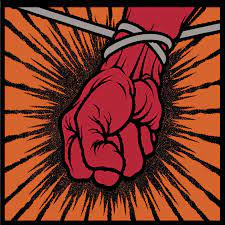
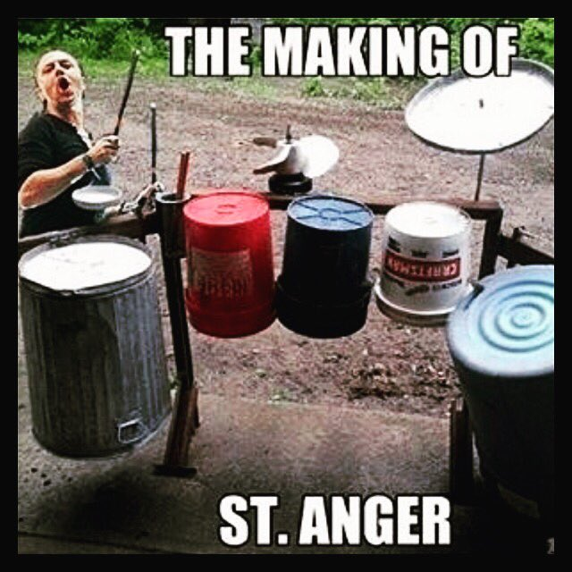

Without a doubt, this monstrosity of an album (if it's even fair to call it an album) was extremely disapointing. The drumming is pure awful. Literally nothing from this album is worth listening to.

## 9. Reload (1997)
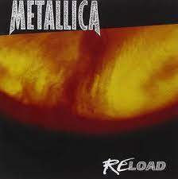

After disapointing fans, they released Reload. This album is very mid. Not bad, just mid. Not much to say about this record. The best song is 'Fuel', everything else is forgetable.

## 8. Load (1996)
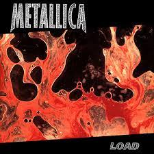

After leaving some people disapointed with the Black Album, they disapointed everyone with Load. I am not saying this is a bad record, it is just a huge step down. It still has some great songs. 'Hero of the Day', and King Nothing are great songs.

## 7. Death Magnetic (2008)
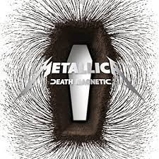

This was a breath of fresh air for fans. With Load, Reload, and then St Anger, it felt as 
though the band had no hope left. And then they released Death Magnetic. A return to their 
thrash metal roots. 'The Day that Never Comes' and 'All Nightmare Long' are bangers. While this may not be their best work, it is still miles better than St Anger.

## 6. Hardwired... To Self-Destruct (2016)
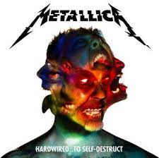

Their latest release. This album does not get nearly enough love. From the title track, to 
'Atlas, Rise!', to 'Moth Into Flame', to 'Spit Out the Bone', this album is filled with great 
songs.

## 5. Metallica (1991)
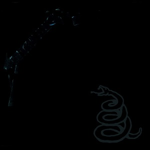

This is without a doubt one of the most overplayed metal albums. That being said, it is still a
very good record. I know this is considered by many to be "selling out", but I disagree. While yes,
'Nothing Else Matters' is definitely selling out and is a very mid song, most of the stuff on here 
goes hard. 'Sad But True', 'The Unforgiven', 'Wherever I May Roam', and the ever so popular 
'Enter Sandman' are all certified bangers.

## 4. ...And Justice For All (1988)
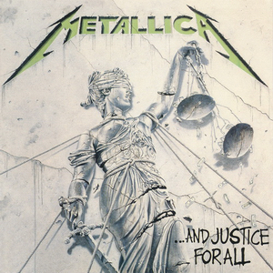

Now we get into Metallica at their prime. I feel like out of their first 4 albums,
this is the worst. I still love this album, it has some amazing songs like 'Blackened', 
'Harvester of Sorrow', and my personal favorite, 'One'. However, the bass in this album is 
not nearly as good as their first 3.

## 3. Kill 'Em All (1983)
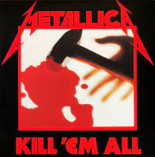

Metallica's debut album is without a doubt their most agressive record. While this 
was not nearly as commercially successful as the Black Album or Master of Puppets, 
it is still very good. The only thing keeping it back is the bad production value. 
Notable tracks include 'Seek & Destroy', 'Whiplash', 'The Four Horsemen', and 'Hit the Lights'.

## 2. Master Of Puppets (1986)
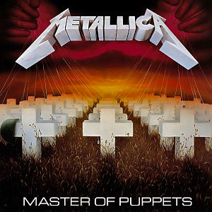

This is what most metal fans consider Metallica's best work and for good reason. 
However, this is not higher up because this is not very consistent. My favorite songs 
from this would be 'Master of Puppets', 'Battery', 'Leper Messiah', and 'Welcome Home (Sanitatium)'.

## 1. Ride The Lightning (1984)
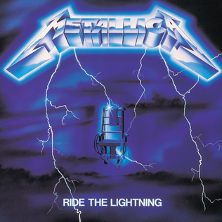

My favorite Metallica album. Every song from this record is a certified banger.
From the title track, to 'For Whom the Bell Tolls', to 'Fade to Black', to the instrumental 
'The Call of Ktulu'. Even 'Escape' is good. The production was a huge step up from Kill 'Em All.
This album is a true masterpiece.
