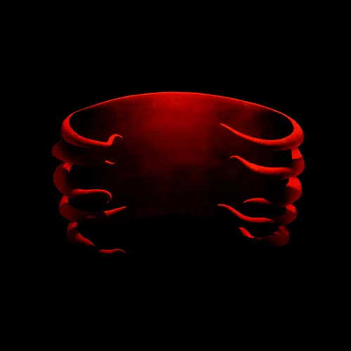
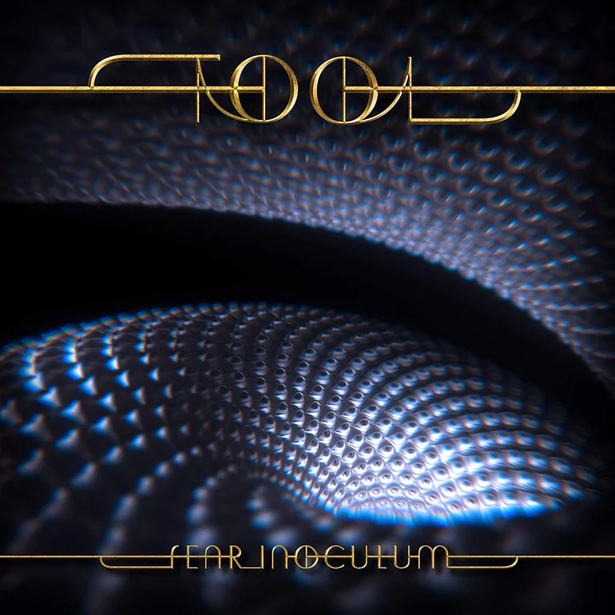
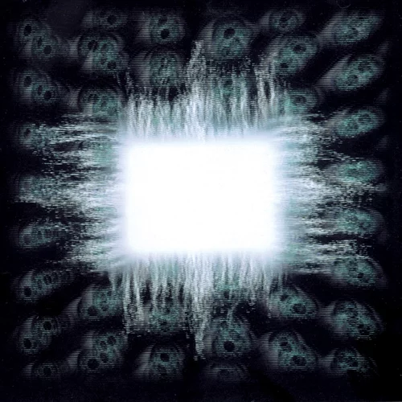

# Tool Discography Ranked

## 5. Undertow (1993)

At number five, we have Tool's debut, Undertow. I feel like this album is not as good as the others simply because, it does not have that much to offer. 'Sober' as an absolute banger but the rest are very forgettable.

## 4. Fear Inoculum (2019)

Up next, we have Tool's latest release, Fear Inoculum. This highly anticipated record has very long songs, but somehow makes use of every second. From the title track, to 'Pnuema', to '7empest', this is a very solid album.

## 3. 10,000 Days (2006)

A very underrated masterpiece. With songs like 'The Pot', '10,000 Days', and my personal favorite, 'Vicarious', this is a very good record.

## 2. Ænima (1996)

This is a very unique work of art. With songs like 'Forty Six & 2', 'Stinkfist', 'Ænima', and the prog oriented 'Third Eye', this album is a very unique masterpiece.

## 1. Lateralus (2001)

This is hands down Tool's best work. Maynard's vocals are insane in this album. From the title track, to 'Schism', to 'Parabola', to 'The Grudge', this album is a masterpiece.
